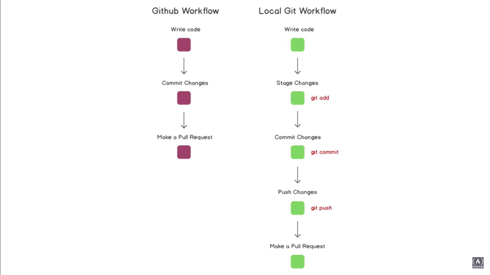
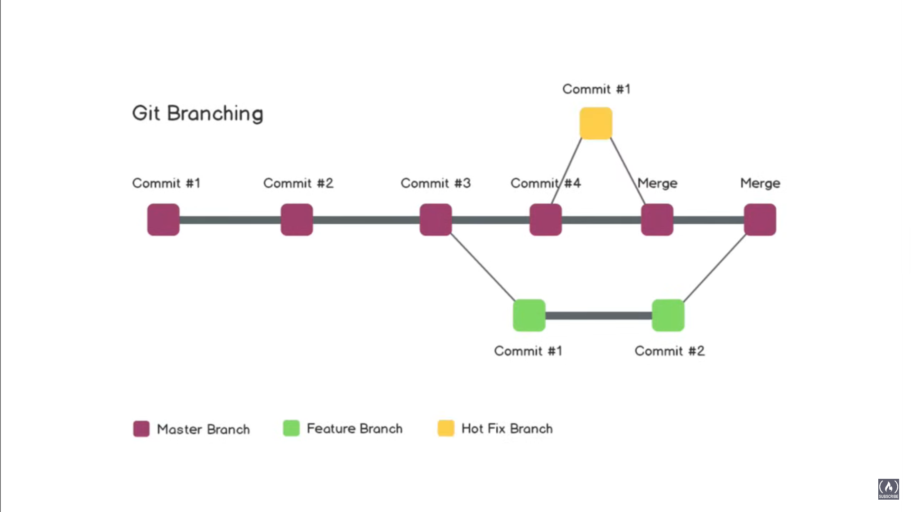
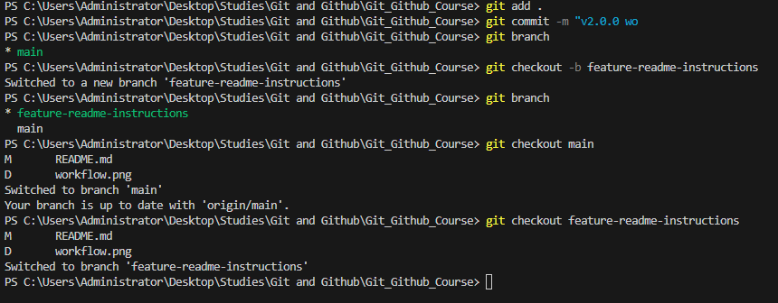

# Git and Github Course

Terms

- `Git` is a verstion control system.
- `Directory` -> Folder
- `Terminal or Command Line` -> Interface for Text Commands
- `CLI` -> Command Line Interface
- `cd` -> Change Directory
- `Code Editor` -> Word Processor for Writing Code
- `Repository` -> Project, or the folder/place where your project is kept
- `Github` -> A website to host your repositories online

Git Commands

* repo -> repository
* `clone` -> bring a repo down from the internet (remote repository like Github) to your local machine
* `add` -> track your files and changes with Git
* `commit` -> save your changes into Git
* `push` -> push your changes to your remote repo on Github (or another website)
* `pull` -> pull changes down from the remote repo to your local machine

* `status` -> check to see which files are being tracked or need to be commited
* `init` -> use this command inside of your project to turn it into a Git repository and start using Git with that codebase


## Basic Commands

### Demo for pulling repository and pushing it to remote.
```python 
git clone https://github.com/Jamil1016/Git_Github_Course.git
cd ./Git_Github_Course

# Changes made

git status #(*check the changes if there's untrack or modified*)
git add . #(*"." to track all ; "file name" if specific file only*)
git commit -m "v0.1.0 README.md: Add Terms and Git Commands" #(*This will saved the changes to local repository*)
git push origin main #(*to push the changes to remote repository ; "origin" is the git clone and  branch name "main"*)
```


### Demo for making local repo without pulling it from remote repo first
```python
cd ./Git_Github_Course
git init
# Changes made
git status
git add .
git commit -m "v0.0.0 Created README"

# Create a repo in Github and copy the HTTPS local code(https://github.com/Jamil1016/Git_Github_Course.git)

git remote add origin https://github.com/Jamil1016/Git_Github_Course.git
git remote -v #(*To check any remote that is connected to the current local repo*)
git push origin master
```

### Workflow


*Comparison of performing in Github and in local*

## Git Branching

Use to work seperately before commiting to main branch. This is always used in projects with multiple person working on a single project.


*Shows how branchign works*

```python
git branch # To list down all the branches.
git checkout -b feature-readme-instructions # To switch between branches (git checkout) by adding -b it creates new branch
git branch # output : main, feature-readme-instructions ; "*" is the active.
git checkout main #will activate the main.
```
### Results


any changes made in the `feature-readme-instructions` will not show in `main` .

To push the branch to github.
```python
git push --set-upstream origin feature-readme-instructions # this will push the branch to remote repo and wil make a push request to main branch
```

1. In github a notif will show saying "make a pull request".
2. In the comment write a description of changes made.
3. If no problem encountered, press "Merge pull request".

### Deleting branch
```python
git branch -d feature-readme-instructions
```

